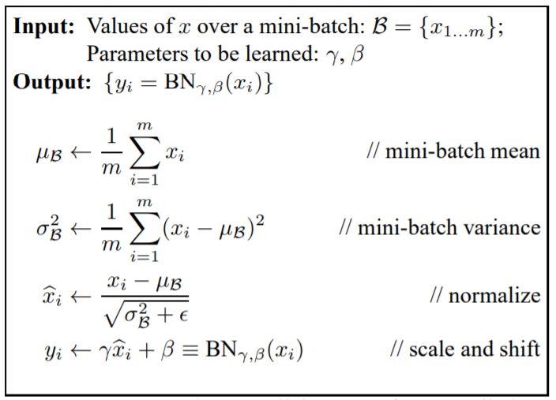
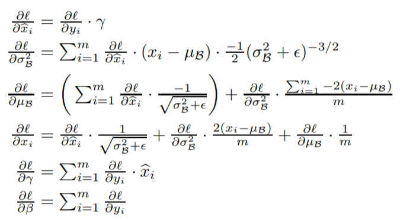
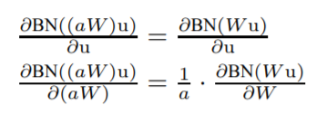

# Bath-Normalization
"Batch Normalization:Accelerating Deep Network Training by Reducing Internal Covariate Shift"这篇论文让我再一次见识到数学之美，也让我再一次深刻地认识数学。本科学习的数学可以分为两类：高数和统计学。前者在于研究空间与空间的转换关系，而后者则在于研究空间中的分布关系且更贴近于实际。之前，我一直没有弄明白统计学的知识是可以如何地加入到neural network之中。现在想想，其实这很显然。因为neural network中的每一个neural unit可以看作是某一种特征。那么该特征在其空间中必然存在着某一分布，那么统计学的知识就可以应用到neural network之中。Batch Normalization主要用于减少模型训练过程中的internal covariate shift，固定activation的distribution，降低模型的训练难度。在训练过程中，模型参数的变化导致了神经元激活的分布也处于变化之中。所以，在学习过程中模型需要一直不断地适应不同的分布，这加大了模型的训练难度。而Batch Normalization则通过归一化，将activation转换到标准正态分布之中，固定了activation的分布。之后，其在通过线性变换来保留模型的表示能力。 
    
  
Batch Normalization的改进有以下两点：1.使用mini-batch的mean和var来代替整个train dataset的mean和var，这降低了模型的计算复杂度，也使得batch Normalization operation能够更好地嵌入到neural network之中；2.每个神经元的activation distribution是相互独立。这避免了计算同层神经元的covariance。
Batch Normalization的作用有以下几点：1.降低模型的训练难度。Batch Normalization固定了神经元激活值的分布，使得模型在训练的过程中无需频繁地去适应神经元激活值的分布的变动。2.提高模型的收敛速度。Batch Normalization会使得神经元的激活值位于非线性函数的非饱和区，避免了梯度消失，加快模型的训练速度。同时，它也使得在模型过程中使用更大的学习率成为可能。这是因为在Batch Normalization中，较大的weight会获得较低的gradient。根据公式推导结果，当梯度流经batch normalization层的时候，损失函数对于权重的梯度会乘上一个缩放因子。当权重较大时，这就缩放因子就减小。相当于较大的权重会得到较低的梯度。所以在训练的时候我们可以使用较大学习率，而无需过度担心梯度爆炸的问题。  
  
3.正则化模型。在训练的过程中，模型需要计算神经元在该batch的mean和var。这使得同一个batch的样本产生了一定的关联性。所以模型在训练过程中并不会产生一个偏向于某一个样本的weight。这种正则化方法不同于dropout。同时，在使用batchnorm的时候，我也可以减少loss function中正则化项的权重。  
Batch Normalization包含了四个参数：mean，var，gamma和peta。其中gamma和peta为学习参数。每一个参数的长度等于神经元的数量或者通道的数量。  
NOTE：在使用Batch Normalization的神经网络层中，其可以无需使用bias，因为该项会在归一化过程中被消去，而之后的peta会使用activation产生偏移。
